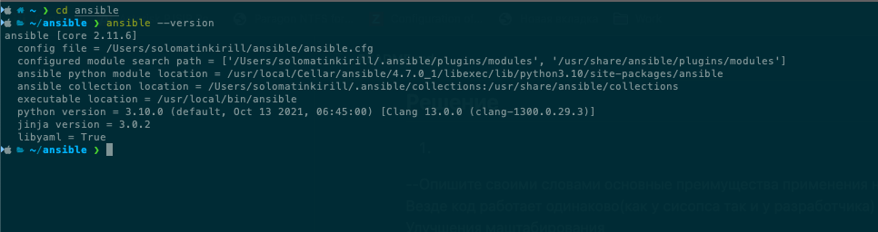

## Решение
1.
  --Опишите своими словами основные преимущества применения на практике IaaC паттернов.  
  Везде код работает одинаково(как у сисопса так и у разработчика)  
  Улучшения маштабирования  
  Более быстрый деплой  
  После мерджа запускаются тесты и потом в прод.  
  --Какой из принципов IaaC является основополагающим?  
  позволяет быстрее конфигурировать инфраструктуру и направлен на обеспечение прозрачности  

2.  
  На мой взгляд более эффективный это pull модель.
  Был у нас в организации puppet и прям так себе. Нет нормальных спецов, очень специфический. Если нужно что-то   поменять то менять этот ямл, потом puppet-null, потом заносит на ноды, а сделал опечатку в коде и приехали.  
  Я работаю с астерисками и там зашла ансибл модель. И тачки налить и инфу посмотреть.  
    

3.  Скрины  

