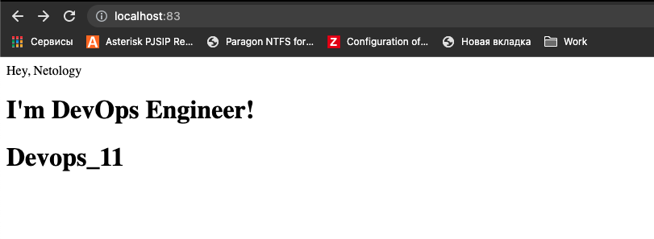
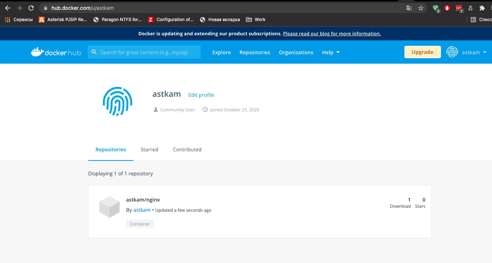
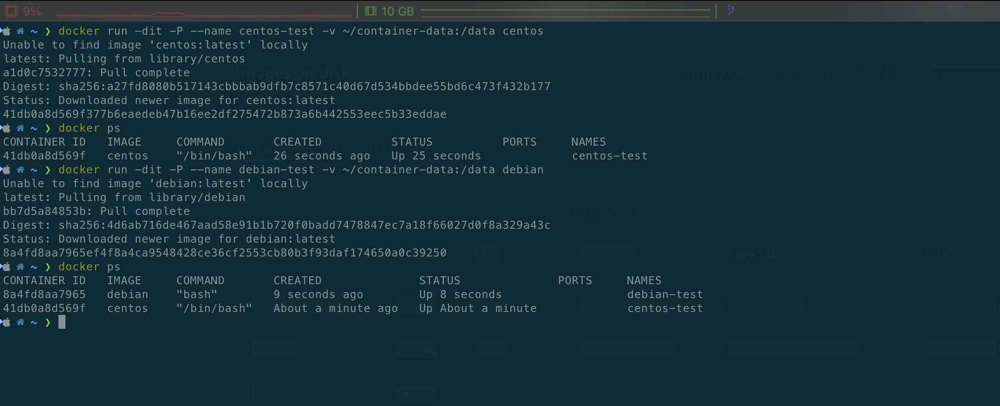
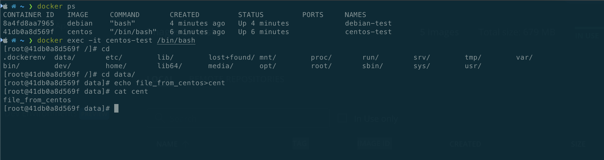
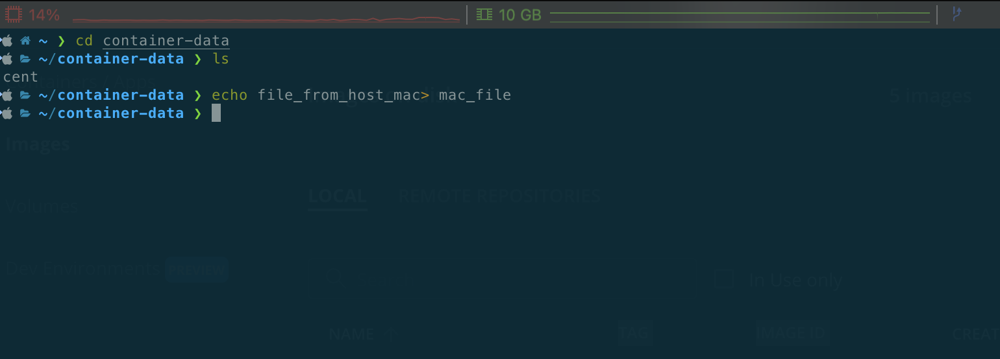
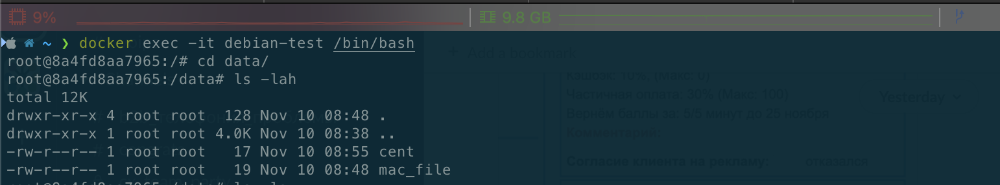

# Домашнее задание к занятию "5.3. Контейнеризация на примере Docker"
1.  
```~/Docker ❯ docker run  -d -p 83:80 nginx   ```                                    
8f15570062955269edb483fc5c1d2f2db49ca28cd37524e95241c9062641ab80  
```~/Docker ❯ docker ps  ```   
CONTAINER ID   IMAGE     COMMAND                  CREATED          STATUS         PORTS                NAMES  
8f1557006295   nginx     "/docker-entrypoint.…"   10 seconds ago   Up 9 seconds   0.0.0.0:83->80/tcp     magical_mcnulty  
```~/Docker ❯ docker exec -it 8f1557006295 bash  ```   
root@8f1557006295:/usr/share/nginx/html# vim index.html  
  
```~/Docker ❯ tag nginx astkam/nginx:0.0.1  ```   
```~/Docker ❯ docker push astkam/nginx:0.0.1  ```   
The push refers to repository [docker.io/astkam/nginx]  
9959a332cf6e: Mounted from library/nginx  
f7e00b807643: Mounted from library/nginx  
f8e880dfc4ef: Mounted from library/nginx  
788e89a4d186: Mounted from library/nginx  
43f4e41372e4: Mounted from library/nginx  
e81bff2725db: Mounted from library/nginx  
0.0.1: digest: sha256:7250923ba3543110040462388756ef099331822c6172a050b12c7a38361ea46f size: 1570  
  
 ```https://hub.docker.com/r/astkam/nginx/tags```   

2.  
```Высоконагруженное монолитное java веб-приложение;```  
   физический сервер,  монолитное, следовательно в микросерверах не реализуемо без изменения кода,  
  и так как высоконагруженное -  то необходим физический доступ к ресурсами.  
```Nodejs веб-приложение;```  
   это веб приложение, для таких приложений достаточно докера.  
```Мобильное приложение c версиями для Android и iOS;```  
   Виртуалка -  приложение в докере не имеет GUI, а это по описанию не вариант.  
```Шина данных на базе Apache Kafka;```  
   зависит от передаваемых данных или контура (тест/прод), для прода и критичности данных лучше Виртуалку, для   теста достаточно докера.  
```Elastic stack для реализации логирования продуктивного веб-приложения - три ноды elasticsearch, два logstash и две   ноды kibana;```  
   сам Elasticsearch лучше на виртуалку, отказоустойчивость решается на уровне кластера,  
  кибану и логсташ можно вынести в докер контейнер, или так же на виртуалках.  
```Мониторинг-стек на базе prometheus и grafana;```  
   сами системы не хранят как таковых данных, можно развернуть на Докере.  
```Mongodb, как основное хранилище данных для java-приложения;```  
   можно использовать Виртуальную машину.Докер для БД так себе, отдельный сервак слишком.  
```Gitlab сервер для реализации CI/CD процессов и приватный (закрытый) Docker Registry```  
   Погуглил и нашел несколько статей где ставят это добро в докер и не знают проблем это самое рациональное решение.      
3.  
Запу(ст,л)им образ с Centos и Debian    
  
Подключились к Centos и создали файл  
  
Создали файлик с хоста  
   
Посмотрим с дебиана  

