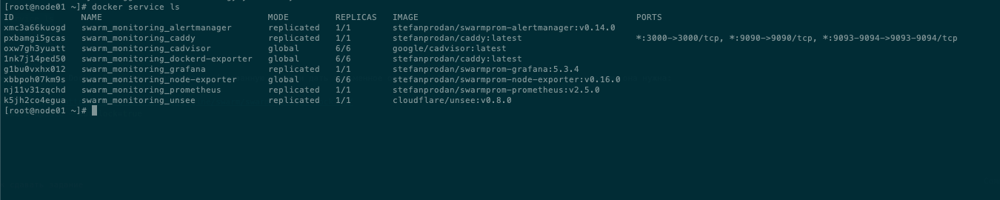
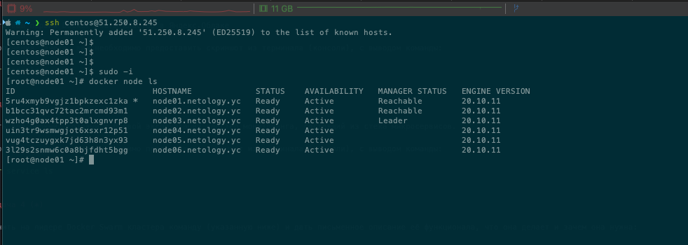

# Домашнее задание к занятию "5.5. Оркестрация кластером Docker контейнеров на примере Docker Swarm"

## Задача 1
В чём отличие режимов работы сервисов в Docker Swarm кластере: replication и global?  
Без ограничения размещения служба в глобальном режиме будет развернута с одной репликой на каждом узле кластера  
Сервисы в реплицированном режиме обычно распределяются по узлам, но также могут быть размещены на одном узле  

Для обеспечения отказоустойчивости кластера используется алгоритм Raft — любой из manager-узлов в любой момент времени может заменить leader-узел  

Overlay network или наложенная сеть или оверлей — виртуальная сеть туннелей, работающая поверх физической.  

## Задача 2

   

## Задача 3

---
