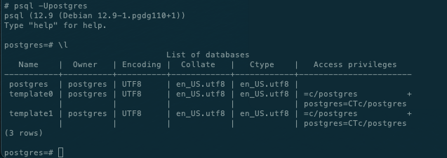
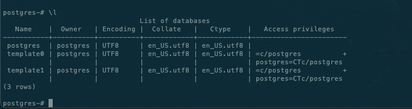
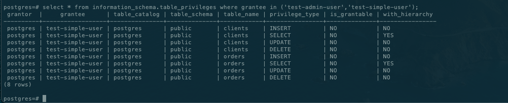
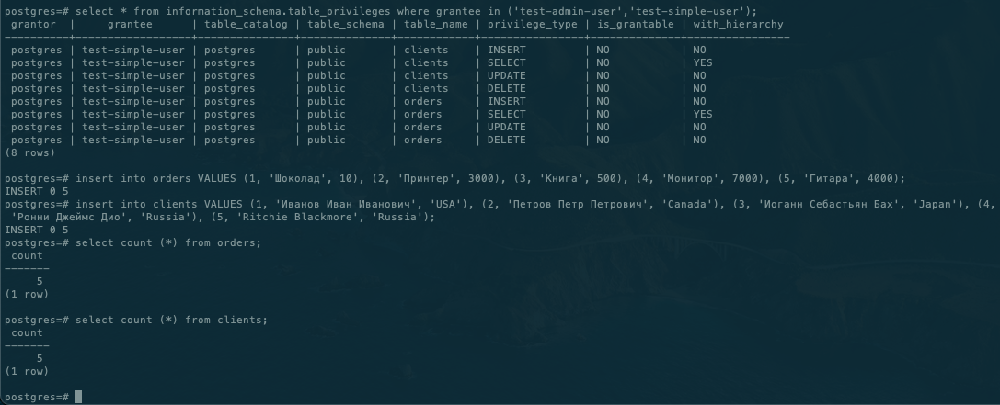
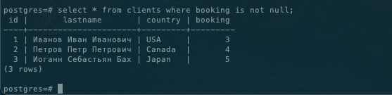
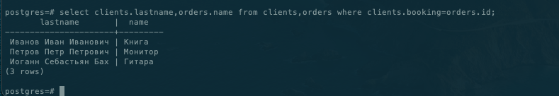
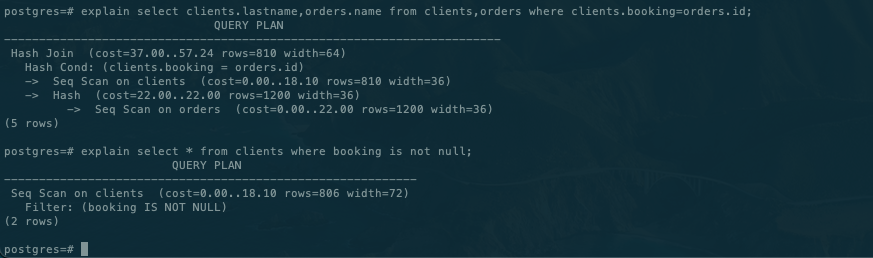

## Решение

## Задание 1  

```docker pull postgres:12```  
```docker volume create vol1 ```  
```docker volume create vol2 ```  
```docker run --rm --name pg-docker -e POSTGRES_PASSWORD=postgres -ti -p 5432:5432 -v vol1:/var/lib/postgresql/data -v vol2:/var/lib/postgresql postgres:12 ```  

---
## Задание 2  

CREATE DATABASE test_db  
CREATE ROLE "test-admin-user" SUPERUSER NOCREATEDB NOCREATEROLE NOINHERIT LOGIN;  

CREATE TABLE orders   
(  
id integer,   
name text,   
price integer,   
PRIMARY KEY (id)   
);  

CREATE TABLE clients   
(  
	id integer PRIMARY KEY,  
	lastname text,  
	country text,  
	booking integer,  
	FOREIGN KEY (booking) REFERENCES orders (Id)  
);  

CREATE ROLE "test-simple-user" NOSUPERUSER NOCREATEDB NOCREATEROLE NOINHERIT LOGIN;  
GRANT SELECT ON TABLE public.clients TO "test-simple-user";  
GRANT INSERT ON TABLE public.clients TO "test-simple-user";  
GRANT UPDATE ON TABLE public.clients TO "test-simple-user";  
GRANT DELETE ON TABLE public.clients TO "test-simple-user";  
GRANT SELECT ON TABLE public.orders TO "test-simple-user";  
GRANT INSERT ON TABLE public.orders TO "test-simple-user";  
GRANT UPDATE ON TABLE public.orders TO "test-simple-user";  
GRANT DELETE ON TABLE public.orders TO "test-simple-user";  






## Задание 3

  

## Задание 4  
update  clients set booking = 3 where id = 1;  
update  clients set booking = 4 where id = 2;  
update  clients set booking = 5 where id = 3;  
  

  

## Задание 5  
   
Показывает стоимость нагрузки выполнения запросов.  
При объединении таблиц запрос тяжелее.  

## Задание 6
docker exec -t pgre-docker pg_dump -U postgres test_db -f /var/lib/postgresql/data/dump_test.sql  
docker exec -i pgre-docker2 psql -U postgres -d test_db -f /var/lib/postgresql/data/dump_test.sql  

SET  
SET  
SET  
SET  
SET  
 set_config   
------------  

(1 row)  

SET  
SET  
SET  
SET  
SET  
SET  
CREATE TABLE  
ALTER TABLE  
CREATE TABLE  
ALTER TABLE  
COPY 5  
COPY 5  
ALTER TABLE  
ALTER TABLE  
ALTER TABLE  
GRANT  
GRANT  
